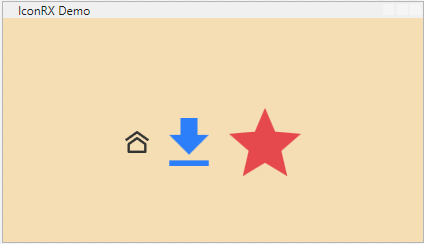

# IconRX

SVG icons for WPF.

Drop an .svg file in your project, point `Source="/YourPath/my-icon.svg"` at it, and you get a crisp icon you can color and resize however you want. Simple and easy.

```xml
<icon:Icon Source="/Assets/home.svg" Width="24" Height="24" Foreground="Black" />
```



## Highlights

- **No code tied to icons:** your XAML just does `<icon:Icon Source="/Assets/home.svg" />`.
- **Plays well with the designer:** pack URIs are resolved against the loaded assemblies, so the icon also shows in the XAML editor.
- **Renders out of the box:** ships its own default template (`Themes/generic.xaml`), colored by `Foreground`.
- **No extra dependencies:** plain WPF.

## Install

```bash
dotnet add package IconRX
```

## Prerequisites

- .NET Framework 4.8 or .NET 8.0-windows+, WPF.
- SVG files must be embedded as WPF resources:
  - In Visual Studio: set **Build Action = Resource**, or
  - In the `.csproj`: `<Resource Include="Assets\**" />`.

## Quick Start

**1.** Add an SVG to your project (e.g. `Assets/home.svg`) compiled as a resource.

**2.** Register the namespace and drop the control in XAML:

```xml
<Window xmlns:icon="clr-namespace:IconRX;assembly=IconRX">
    <icon:Icon Source="/Assets/home.svg" Width="24" Height="24" Foreground="Black" />
</Window>
```

The control combines the `d` attribute of every `<path>` in the SVG into a single `Geometry`, so any monochrome SVG works (switch `Fill`/`currentColor` with `Foreground`).

## API

| Member | Description |
| --- | --- |
| `Source` | Pack URI of the embedded SVG (e.g. `/Assets/home.svg`). |
| `Data` | Parsed `Geometry`. Set automatically from `Source`. |
| `Foreground` | Brush used by the default template to fill the icon. |
| `Width` / `Height` | Standard layout (default 24×24). |

Resolution order: the library's own assembly, then loaded assemblies (covers the designer), then the bare application pack URI.

## Demo

A runnable example lives in [IconRXDemo](./IconRX/IconRXDemo): icons embedded as resources, shown at different sizes and colors.

## License

[MIT](./LICENSE) — Copyright (c) 2026 Bracozs